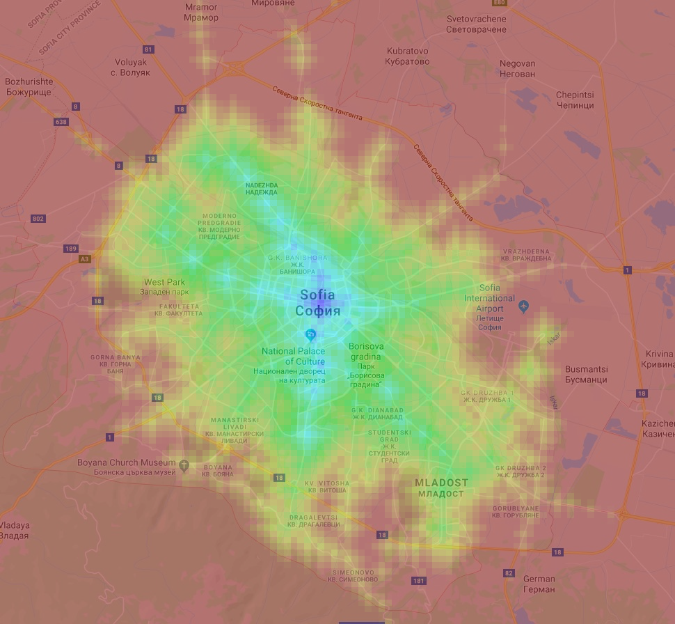

# Sofia Distance Map

## Overview
Sofia Distance Map is a tool for visualizing temporal distances using public transport in Sofia, Bulgaria.

It consists of three scripts:
* `scrape.py ` - scrapes official public transport route data
* `graph.py` - using the list of stops and all the scraped route data constructs a graph and calculates shortest time between each pair of squares in a grid
* `visualize.py` - presents the calculated shortest times on a map

## Background
In an attempt to find affordable accommodation in Sofia, I wanted to get a sense of how far away different parts of the city were _temporally_, rather than spacially.

Sofia's public transport system is dense, but variable in quality depending on which route you're taking. I figured this map would reveal some non-obvious well-connected areas (and hopefully cheaper than they should be).

## Usage
TL;DR - Here's how to run the visualization in short:
* Run `python graph.py --width 50 --height 50`. This will take several minutes.
_Note: You may supply different dimensions, but this will result in a quadratic slowdown and increase of the resulting file's size. The file for 100x100 is 762MB._
* Run `python visualize.py --width 50 --height 50` and wait for it to load the file generated by the previous step.

#### `scrape.py`
Simply running `python scrape.py` should prompt it to begin fetching data from the Urban Mobility Center's timetable pages.

For each route, this script will collect:
* Stops this route traverses and in what order
* Official estimated time from each stop to the next
* Median waiting time at any stop

Once finished, all collected data will be written to `routes.txt`.
The output of this script is already included within the repository, but it may not be up to date (as there may be some new/updated routes).

#### `graph.py`
Example usage: `python graph.py --width 50 --height 50`

Requires a `routes.txt` list of routes file (generated via `scrape.py`) and a `stops-bg.json` list of stops file (can be found at [this address](https://routes.sofiatraffic.bg/resources/stops-bg.json)).

Constructs a weighted directed graph with the help of the [NetworkX](https://github.com/networkx/networkx) package.

The graph contains three types of nodes:
* Grid cell nodes - represent a regular chunk of land; their size depends on the dimensions of the grid (by default 100x100)
* Stop/station nodes - represent a public transport stop; a stop node is connected to a grid cell node if the stop it represents is contained within the grid cell
* Route nodes - represent a stop on a specific route; a route node is connected to the next node on the route and to the stop node it relates to

Dijkstra's algorithm is ran on each pair of grid cell nodes and the resulting (temporal) distances are saved to a distance matrix file `distance-matrix.npy`.

#### `visualize.py`
Example usage: `python visualize.py --width 50 --height 50 --direction 'from'`

Creates an interactive heatmap of Sofia, visualizing the (temporal) distance map generated by `graph.py`.

Clicking on a cell turns it into the heatmap's source. Depending on the direction mode supplied as a command-line argument the heatmap produced represents temporal distances from/to each point on the map to/from the source point.

Additionally, shift-clicking on a different cell adds it as another source. The heatmap will now represent the average of the heatmaps for both sources. This can be useful for measuring connectivity to/from multiple points on the map.

Shift-clicking a source cell will remove it from the list of sources and a regular click will clear the list of sources, leaving only the clicked cell.

The window also features sliders for controlling the colors for the visualization - namely the minimum and the maximum (temporal) distance to be considered. Anything outside these margins will be colored in a uniform manner. The values of the sliders are in minutes.